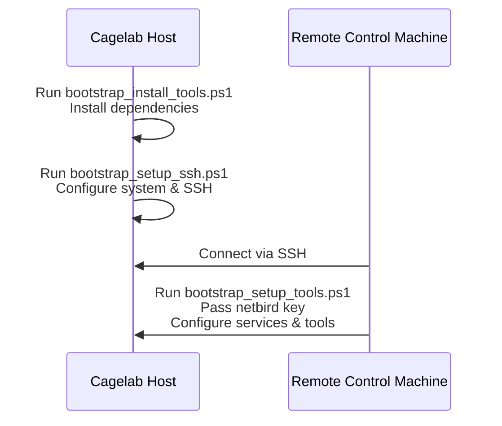

# Cagelab Bootstrap Script Guide

[中文](https://github.com/CogPlatform/Setup/blob/main/bootstrap/windows/README.zh-cn.md)

## Overview

Due to certain Windows limitations, the bootstrap process is split into **three scripts**, which must be executed in order:

| Order | Script Name                   | Requires Admin Privileges | Purpose                                                     |
| ----- | ----------------------------- | ------------------------- | ----------------------------------------------------------- |
| 1     | `bootstrap_install_tools.ps1` | ❌ No                     | Install dependencies and tools                              |
| 2     | `bootstrap_setup_ssh.ps1`     | ✅ Yes                    | Configure system and SSH                                    |
| 3     | `bootstrap_setup_tools.ps1`   | ✅ Yes                    | Configure services and tools (remote execution recommended) |

---

## 1. bootstrap_install_tools.ps1

> **No administrator privileges required**

This script installs all dependencies required by **Cagelab**.

### Runtime Components

| Installation Method | Components                                                              |
| ------------------- | ----------------------------------------------------------------------- |
| **winget**          | `winget`, `pwsh`, `nomachine`                                           |
| **scoop**           | `scoop`, `git`, `netbird`, `nssm`, `mediamtx`, `obs-studio`, `sunshine` |
| **install script**  | `cogmoteGO`                                                             |

### Development Tools

- `starship`
- `Maple-Mono-NF-CN`

---

## 2. bootstrap_setup_ssh.ps1

> **Administrator privileges required**

This script configures system settings and prepares the SSH environment.

### Network & Power Settings

- Set current network to **Private**
- Enable **High Performance** power plan
- Disable automatic: screen-off / sleep / hibernation

### OpenSSH-Server Configuration

- Install OpenSSH-Server
- Start the service
- Configure firewall rules

---

## 3. bootstrap_setup_tools.ps1

> **Recommended to run via SSH** > **Administrator privileges required**
> This script accepts one parameter: `<netbird-key>`

### Functions

- Configure `mediamtx` as a Windows service
- Configure `cogmoteGO` as a Windows service
- Configure `obs-studio` as a scheduled task (GUI apps cannot run as services)
- Use `setup-key` to configure Netbird

### TODO (Planned)

- [ ] Upload SSH public key to Cagelab via `scp`
- [ ] Headless configuration for Nomachine
- [ ] Headless configuration for Sunshine
- [ ] Prepare obs-studio dotfiles
- [ ] Headless setup for virtual display

---

## Usage

### Requirements

- One **Cagelab host machine**
- One **remote control machine**

### Steps

1. On the **Cagelab host**, run:

   ```powershell
   .\bootstrap_install_tools.ps1
   .\bootstrap_setup_ssh.ps1
   ```

2. From the **remote control machine**, connect to the host via SSH, then run:

   ```powershell
   .\bootstrap_setup_tools.ps1 <netbird-key>
   ```

### Note

> **Why use a remote control machine?**
> This way, you don’t need to log into any accounts directly on the Cagelab host.
> Instead, you simply pass the `setup-key` to configure Netbird.

---

## Bootstrap Sequence Diagram


