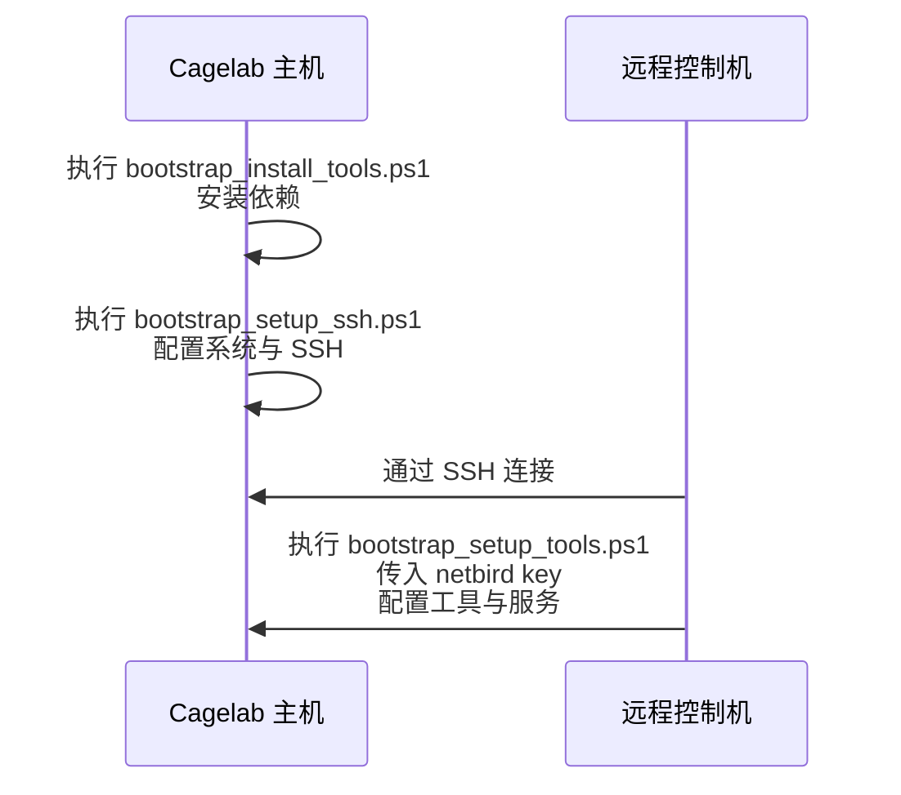

# Cagelab 启动脚本使用手册

## 脚本总览

由于 Windows 的限制，启动流程被拆分为 **三个脚本**，必须按照顺序执行：

| 执行顺序 | 脚本名称                      | 是否需要管理员权限 | 功能概要                     |
| -------- | ----------------------------- | ------------------ | ---------------------------- |
| 1        | `bootstrap_install_tools.ps1` | ❌ 否              | 安装依赖与工具               |
| 2        | `bootstrap_setup_ssh.ps1`     | ✅ 是              | 系统与 SSH 配置              |
| 3        | `bootstrap_setup_tools.ps1`   | ✅ 是              | 工具与服务配置（需远程执行） |

---

## 1. bootstrap_install_tools.ps1

> **无需管理员权限**

该脚本用于安装 **Cagelab 所需的依赖**。

### Runtime 组件

| 安装方式     | 组件                                                                    |
| ------------ | ----------------------------------------------------------------------- |
| **winget**   | `winget`, `pwsh`, `nomachine`                                           |
| **scoop**    | `scoop`, `git`, `netbird`, `nssm`, `mediamtx`, `obs-studio`, `sunshine` |
| **安装脚本** | `cogmoteGO`                                                             |

### 开发工具

- `starship`
- `Maple-Mono-NF-CN`

---

## 2. bootstrap_setup_ssh.ps1

> **需要管理员权限**

该脚本负责系统配置和 SSH 环境准备。

### 网络与电源设置

- 将当前网络设置为 **私有网络**
- 启用 **高性能电源计划**
- 禁止自动：熄屏 / 睡眠 / 休眠

### OpenSSH-Server 配置

- 安装 OpenSSH-Server
- 启动服务
- 配置防火墙规则

---

## 3. bootstrap_setup_tools.ps1

> **推荐通过 SSH 远程执行** > **需要管理员权限**
> 脚本接受一个参数：`<netbird-key>`

### 功能

- 配置 `mediamtx` 为 Windows 服务
- 配置 `cogmoteGO` 为 Windows 服务
- 配置 `obs-studio` 为 Windows 计划任务（因 GUI 程序无法作为服务运行）
- 使用 `setup-key` 配置 Netbird

### TODO（待开发）

- [ ] 使用 `scp` 上传 SSH 公钥到 Cagelab
- [ ] 无人值守配置 Nomachine
- [ ] 无人值守配置 Sunshine
- [ ] 准备 obs-studio dotfiles
- [ ] 无人值守设置虚拟显示器

---

## 使用方法

### 环境准备

- 一台 **Cagelab 主机**
- 一台 **远程控制机**

### 执行步骤

1. 在 **Cagelab 主机**上执行：

   ```powershell
   .\bootstrap_install_tools.ps1
   .\bootstrap_setup_ssh.ps1
   ```

2. 在 **远程控制机**上，通过 SSH 连接到 Cagelab，并执行：

   ```powershell
   .\bootstrap_setup_tools.ps1 <netbird-key>
   ```

### 提示

> **为什么需要远程控制机？**
> 这样无需在 Cagelab 主机上登录任何账号，仅通过传递 `setup-key` 即可完成 Netbird 配置。

---

## 启动流程图


